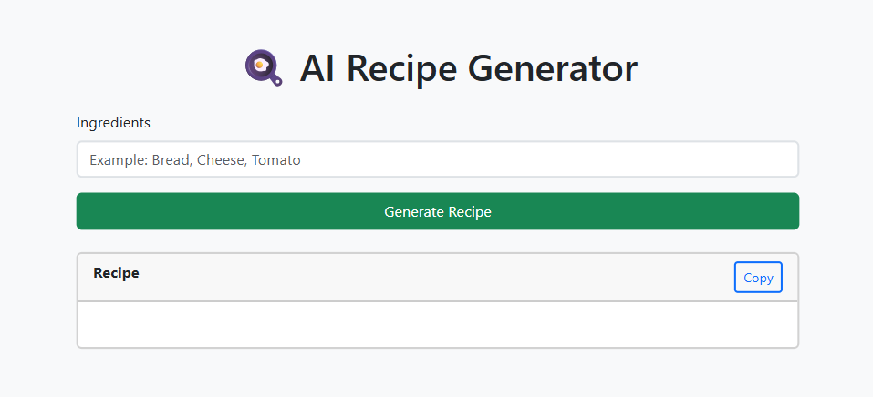
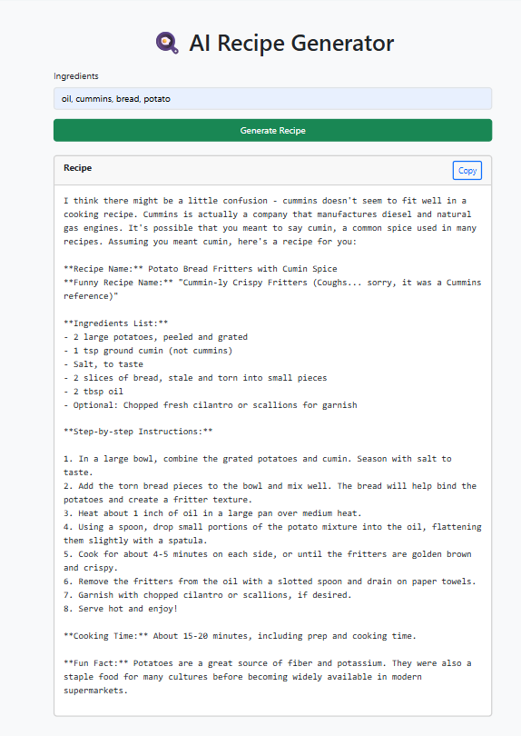

# 🍽️ AI Recipe Generator

An AI-powered **Recipe Generator** built using **Python Flask** and the **Groq API**. Simply enter the ingredients you have, and the application generates a creative recipe complete with a recipe name, funny title, cooking instructions, and a fun cooking fact.

---

## 🚀 Features

- 🥗 Generate recipes from available ingredients
- 🤖 AI-powered recipe generation using **Groq Llama 3.1**
- 🍽️ Creative and funny recipe names
- 📋 Step-by-step cooking instructions
- 💡 Fun cooking facts
- 📄 Copy generated recipes to the clipboard
- 🎨 Clean and responsive user interface
- ⚡ Fast Flask backend
- 🔒 Secure API key management using `.env`

---

## 🛠️ Tech Stack

- Python
- Flask
- HTML5
- CSS3
- Bootstrap 5
- JavaScript
- Jinja2
- Groq API
- python-dotenv

---

## 📂 Project Structure

```text
RecipeGenerator/
│
├── .venv/
├── .vscode/
├── screenshots/
│
├── static/
│   ├── css/
│   │   └── style.css
│   ├── images/
│   │   └── background.jpg
│   └── js/
│       └── script.js
│
├── templates/
│   └── index.html
│
├── .env
├── .gitignore
├── app.py
├── README.md
└── requirements.txt
```

---

## ⚙️ Installation

### 1. Clone the Repository

```bash
git clone https://github.com/PalakD42/RecipeGenerator.git
cd RecipeGenerator
```

### 2. Create a Virtual Environment

#### Windows

```bash
python -m venv .venv
.venv\Scripts\activate
```

#### Linux/macOS

```bash
python3 -m venv .venv
source .venv/bin/activate
```

### 3. Install Dependencies

```bash
pip install -r requirements.txt
```

### 4. Configure Environment Variables

Create a `.env` file in the project root.

```env
GROQ_API_KEY=your_groq_api_key_here
```

Replace `your_groq_api_key_here` with your Groq API key.

### 5. Run the Application

```bash
python app.py
```

Open your browser and visit:

```
http://127.0.0.1:5000
```

---

## 📖 How It Works

1. Enter the ingredients you have.
2. Click **Generate Recipe**.
3. The Flask backend sends the ingredients to the **Groq AI** model.
4. The AI generates a complete recipe.
5. The generated recipe is displayed instantly.
6. Copy the recipe using the **Copy** button if needed.

---

## 📸 Screenshots

### Home Page



### Generated Recipe



---

## 📦 Requirements

Install all required packages:

```bash
pip install -r requirements.txt
```

Main packages used:

- Flask
- groq
- python-dotenv

---

## 🎯 Future Enhancements

- 🍕 Cuisine selection
- 🥦 Nutritional information
- ❤️ Save favorite recipes
- 📜 Recipe history
- 📄 Export recipes as PDF
- 🖼️ AI-generated food images
- 🌙 Dark mode
- 🎤 Voice input
- 🌐 Multi-language support

---

## 🎓 Learning Outcomes

This project demonstrates:

- Flask web development
- AI API integration using Groq
- Environment variable management
- HTML template rendering with Jinja2
- Frontend and backend communication
- Handling user input securely
- Building responsive web applications

---

## 🤝 Contributing

Contributions are welcome!

1. Fork the repository.
2. Create a new branch.

```bash
git checkout -b feature-name
```

3. Commit your changes.

```bash
git commit -m "Add new feature"
```

4. Push to GitHub.

```bash
git push origin feature-name
```

5. Open a Pull Request.

---

## 👩‍💻 Author

**Palak Dwivedi**

Engineering Student

GitHub: **https://github.com/PalakD42**

---

## 📄 License

This project is licensed under the **MIT License**.

---

## ⭐ Support

If you found this project helpful, consider giving it a **⭐ Star** on GitHub.

Happy Coding! 🚀
